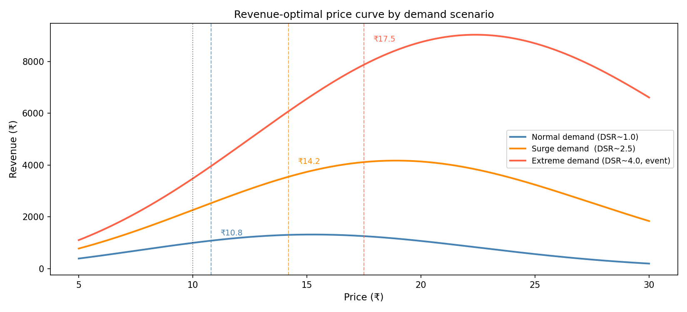
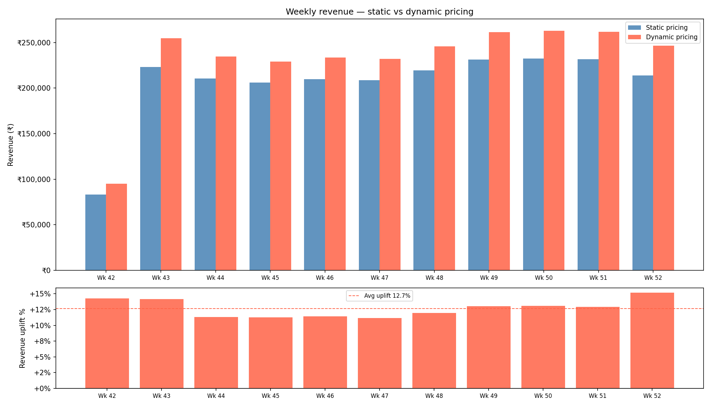
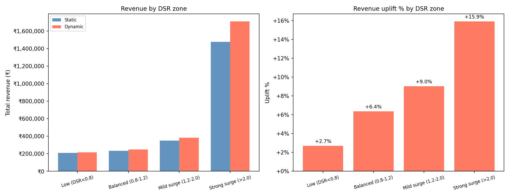
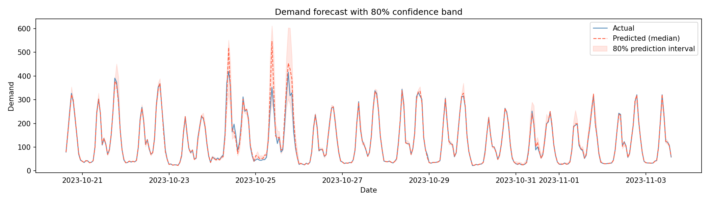

# Dynamic Pricing & Demand Forecasting System
### Ride-hailing / E-commerce style · End-to-end ML pipeline

> A machine learning system that predicts hourly demand and computes
> revenue-optimal dynamic prices — generating a **+12.7% revenue uplift**
> (₹1.45M annualised) with **83.7% demand retention** vs static pricing.

---

## Business Problem
Ride-hailing and e-commerce platforms lose revenue daily by charging
a fixed price regardless of real-time demand and supply conditions.
This system answers three questions:
- What will demand be in the next hour?
- What is the optimal price given current supply pressure?
- How much more revenue does dynamic pricing generate vs static?

---

## Results

| Metric | Value |
|---|---|
| Revenue uplift | **+12.7%** |
| Annualised additional revenue | **₹1,456,400** |
| Demand retained (avg conversion) | **83.7%** |
| Strong surge uplift | **+15.9%** |
| Event hour uplift | **+19.3%** |
| Forecast MAPE | **3.1%** (vs 16.7% naive baseline) |
| Forecast improvement | **+13.6 percentage points** |

---

## System Architecture

```
Raw Data (8,737 hourly records)
    ↓
Feature Engineering (23 features: lags, rolling, DSR, events)
    ↓
LightGBM Demand Forecast  →  Point estimate + 80% confidence band
    ↓
Dynamic Pricing Engine
  ├── DSR-based multiplier (floor 0.8× / ceiling 2.5×)
  ├── Uncertainty discount (wide band → conservative price)
  └── EMA surge smoothing (α = 0.25)
    ↓
Impact Simulation (static vs dynamic · 1,714 test hours)
```

---

## Key Outputs

### Revenue-optimal price curve


### Weekly revenue — static vs dynamic


### Revenue uplift by DSR zone


### Demand forecast with confidence band


---

## Approach

### Phase 1 — Data Generation & EDA
- Synthetic hourly data: 8,737 rows, full year 2023
- 18 injected events (rain, concerts, festivals, holidays)
- Double-peak intraday demand (9am + 6–7pm)
- Price variation for elasticity estimation

### Phase 2 — Demand Forecasting
- **Model**: LightGBM with early stopping (1,006 trees)
- **Features**: 23 (lag features, rolling windows, DSR, event flags)
- **Split**: chronological 80/20 — never random shuffle for time series
- **Baseline**: naive persistence (same hour yesterday) — 16.7% MAPE
- **Model MAPE**: 3.1% — 13.6pp improvement over baseline
- **Confidence intervals**: 5th/95th percentile quantile models (75% coverage)

### Phase 3 — Pricing Engine
- Demand-supply ratio (DSR) drives the base multiplier
- Uncertainty discount: wide confidence band → conservative price
- EMA smoothing (α=0.25) prevents price whipsawing
- Feedback loop: price rise → demand falls → DSR improves → price moderates
- Elasticity (ε = -0.7): 10% price increase → 7% demand decrease

### Phase 4 — Impact Simulation
- 1,714 test hours: Oct 20 – Dec 31 (Diwali, Christmas, NYE)
- Static vs dynamic revenue comparison across all hours
- Breakdown by DSR zone, event type, and week
- Uplift scales with market intensity — confirms system design

---

## Tech Stack
- **Python** — pandas, numpy, scipy
- **ML** — LightGBM, scikit-learn
- **Visualisation** — matplotlib, seaborn
- **Dashboard** — Streamlit
- **Persistence** — joblib

---

## How to Run

```bash
# 1. Clone and install
git clone https://github.com/yourusername/dynamic-pricing-system
cd dynamic-pricing-system
pip install -r requirements.txt

# 2. Generate data
python src/generate_data.py

# 3. Run notebooks in order (01 → 05)
jupyter notebook notebooks/

# 4. Launch Streamlit dashboard
streamlit run app.py
```

---

## Notes on Synthetic Data
The dataset is synthetically generated to simulate a
supply-constrained urban ride-hailing market. The feature
set (lag features, DSR, event flags, rolling windows) mirrors
what would be engineered from real transactional data.
The revenue-optimal price curve uses an illustrative
Gaussian model consistent with the engine's elasticity assumptions.

---

## Author
[Ayesha Firdaus] · [https://www.linkedin.com/in/ayesha-firdaus-8b3a071b6] · [https://github.com/Ayesha0017]